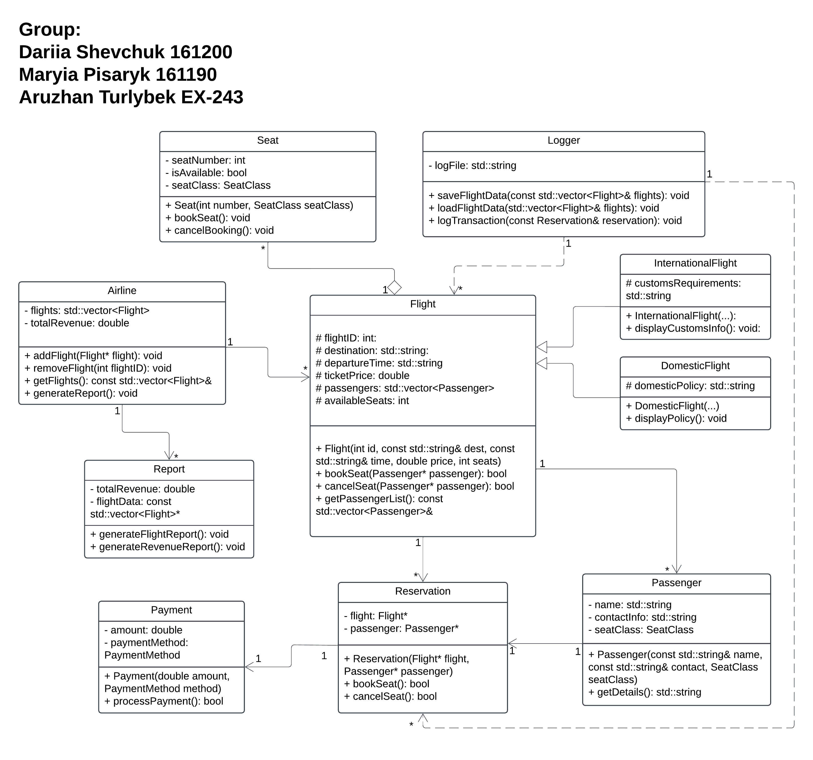

# Airline Reservation System

## Team
- Dariia Shevchuk (161200)  
- Mariya Pisaryk (161190)  
- Aruzhan Turlybek (EX-243)

---

## Overview
The Airline Reservation System is an object-oriented C++ application that models the main operations of an airline company.  
It allows users to manage flights, passengers, reservations, payments, and reporting using an extensible, modular class structure.  

The system demonstrates key OOP principles such as encapsulation, inheritance, and polymorphism, as well as practical file handling for data storage and reporting.

---

## Technologies Used
- Language: C++
- Paradigm: Object-Oriented Programming
- Techniques: Inheritance, Polymorphism, Encapsulation, Abstraction
- Persistence: File I/O for data storage and logs
- Interface: Console-based output
---

## Main Features

### Flight Management
- Supports both **Domestic** and **International** flights through class inheritance (`DomesticFlight`, `InternationalFlight`).
- Loads flight information dynamically from an input file (`flights.txt`).
- Displays details about destinations, departure times, and available seats.

### Passenger and Reservation Handling
- Manages passenger data including name, contact information, and seat type.
- Allows booking and cancellation of seats using the `Reservation` class.
- Establishes relationships between passengers and flights.

### Payment Processing
- Simulates payment operations through multiple methods (`CreditCard`, `DebitCard`, `PayPal`).
- Associates each transaction with a specific reservation.

### Reporting and Logging
- Generates operational and revenue reports using the `Report` class.
- Records every booking and flight update in a log file (`flights_log.txt`) using the `Logger` class.
- Provides clear summaries of flight data and total airline revenue.

---

## System Architecture

The project follows an object-oriented architecture where each class represents a specific real-world concept.  
The diagram below illustrates class relationships and dependencies:

| Class | Responsibility |
|--------|----------------|
| **Airline** | Manages all flights, report generation, and overall operations. |
| **Flight** | Abstract base class defining core flight data and methods. |
| **DomesticFlight** / **InternationalFlight** | Derived classes representing specific flight types. |
| **Passenger** | Stores passenger details and seat preferences. |
| **Reservation** | Links passengers to flights and handles seat bookings. |
| **Payment** | Processes payments for reservations. |
| **Report** | Generates text-based summaries and revenue reports. |
| **Logger** | Handles data persistence and transaction logging. |
| **Seat** / **SeatType** | Defines seat types and availability management. |

---

## Project Files

| File | Description |
|------|-------------|
| `Airline.cpp / .h` | Controls flight creation, loading, and report generation. |
| `Flight.cpp / .h` | Base class implementing common flight logic. |
| `DomesticFlight.cpp / .h` | Adds policy-specific behavior for domestic flights. |
| `InternationalFlight.cpp / .h` | Adds customs and international rules. |
| `Passenger.cpp / .h` | Contains passenger data management methods. |
| `Reservation.cpp / .h` | Implements booking and cancellation logic. |
| `Payment.cpp / .h` | Simulates payment operations. |
| `Report.cpp / .h` | Generates financial and operational reports. |
| `Logger.cpp / .h` | Handles data logging and persistence. |
| `Seat.cpp / .h` | Defines seat objects and their availability. |
| `SeatType.h` | Enum defining seat categories (Economy, Business, First). |
| `flights.txt` | Contains predefined flight data for simulation. |
| `flights_log.txt` | Stores reservation and log entries. |

